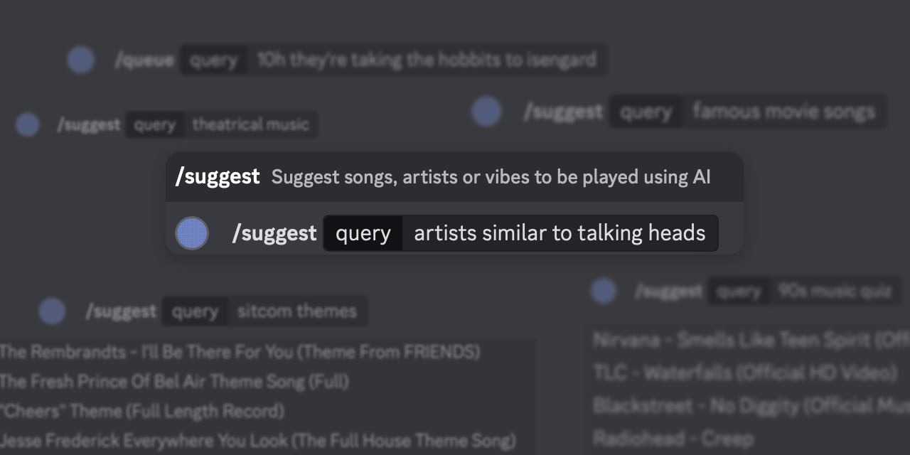

# Clabbe



A personal DJ that can be used locally or as a Discord bot. Uses AI to queue new
songs based on suggestions and recently played songs. Songs are fetched from
YouTube.

Clabbe is named after a Swedish DJ.

## Features

- 🤖 Uses AI to take requests and extrapolate new songs to play
- 🎹 Fetches songs from YouTube
- 🔥 Focus on performance. Docker image is 13MiB. Uses about 10MB of RAM at
  runtime and virtually zero CPU. Other bots can use hundreds of megabytes of
  RAM and up to one CPU core.
- 🚀 Easy to setup. Zero-config other than bot token necessary for basic
  functionality
- 🛰️ Prometheus metrics, liveliness and readiness probe support for maintainable
  deployments using Docker or Kubernetes.

## Using

### Discord

The Clabbe bot exposes [slash commands](https://discord.com/blog/welcome-to-the-new-era-of-discord-apps?ref=badge)
in the Discord server it is invited to. These commands can be used to queue and
suggest music.

All commands require you to be in a voice channel.

#### `/queue <query>`

The queue command will search for a video on YouTube using the specified query.
The top match is added at the end of the queue.

If AI support is enabled and the extrapolate option enabled (default), the bot
will fill the queue on its own once it's empty. It will do this by prioritizing
songs it has added when receiving suggestions (see /suggest). If no suggestions
have been added, it will try to play songs similar to recent listening history.

#### `/suggest <query>` (AI)

If AI support is enabled, the suggest command can be used to ask an AI to play
music by an artist, music of a specific genre, vibe and so on. Suggestions will
be used by the bot once the queue is empty.

The bot should be capable of a wide variety of suggestions. Here's a few
examples that typically work well:

- most played songs 1986
- songs about dogs
- famous guitar riffs
- 90s music quiz
- famous cover songs
- rock & roll duets

#### `/playlist`

The playlist command prints the current playlist.

#### `/suggestions` (AI)

The suggestions command prints the current suggestions.

#### `/recent`

The recent command prints recently played songs.

#### `/skip`

The skip command skips the currently playing song.

#### `/stop`

The stop commands immediately disconnects the bot. The bot can be rejoined using
the /play command. Stopping the bot does not affect the queue or suggestions.

#### `/play`

The play command connects the bot to the voice channel you're in and requests it
to start playing songs from the queue.

## Running

### Discord

The bot needs a Discord bot token to run. The token can be specified in a config
file or as an environment variable. The config, queues and history are stored in
a configurable directory.

```yaml
discordBotToken: xxx
```

```shell
export DISCORD_BOT_TOKEN="xxx"
```

The bot can then be started on the host or using Docker.

```shell
./bot --config ./config
```

```shell
docker run ghrc.io/alexgustafsson/clabbe --config ./config
```

## Development

Clabbe is written in Go. It's meant to be small and fast rather than fully
featured, big and slow.

The code base consists of the following notable parts:

- `internal/bot` - a platform agnostic bot. Exposes core bot functionality.
- `internal/discord` - a Discord adapter for the bot.
- `internal/ebml`, `internal/webm` - a webm demuxer in order to stream opus
  samples immediately from a source to Discord.
  - `internal/ffmpeg` - an ffmpeg abstraction to process and normalize audio using
  ffmpeg. Currently only used for development tools.
- `internal/openai` - an OpenAI API client.
- `internal/state` - state management.
- `internal/streaming`, `internal/streaming/youtube` - abstractions and
  implementations for searching for videos on YouTube and streaming them.

### Building

Clabbe is written in Go. To build on host, Go 1.21 or later is required.

```shell
go build -o bot cmd/bot/main.go
```

It's also possible to build Clabbe using Docker.

```shell
DOCKER_BUILDKIT=1 docker build --output=. .
```
